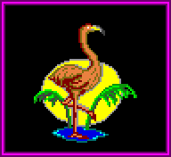

| File     | Memory   | Segment |
| -------- | -------- | ------- |
| BORDERS  | (0x5000) | DS:48B8 |
| ARCHTYPE |          | DS:4CA2 |
| HDSPCT   | 1180     | DS:37E8 |

# FONT

This is allocated to DS:56EC.

First two bytes define number of sprites in the file (209 (0xD1)). The
sprite content is shown in the below image (19 x 11 sprites):

Each sprite is 8x8 pixels. However, when stored in the FONT file, it is stored
4x8 (32 bytes) rather than 64 bytes. The nibbles of the 4 bytes are swapped
around to form an 8x8 image.

# GANI

The GANI file seems to contain a single image of a flamingo. It is 1130 bytes,
and after decompression, inflates to 4236 bytes. The first two bytes seem to
describe the end offset of the image.

| Offset        | Value    | Purpose                              |
|---------------|----------|--------------------------------------|
| 0x00          | 0x01     | Unknown (number of images?)          |
| 0x01-0x02     | 0x8910   | Size of image (0x1089)               |
| 0x03          | 0x05     | Unknown                              |
| 0x04          | 0x00     | Unknown                              |
| 0x05          | 0x30     | Number of words per line (48)        |
| 0x06          | 0x58     | Height of image (88 pixels)          |
| 0x07          | 0x00     | ?                                    |
| 0x08          | 0x00     | ?                                    |
| 0x09 - 0x1089 | variable | Image data of flamingo               |
| 0x108A        | 0x01     | ?                                    |
| 0x108B        | 0x00     | ?                                    |
| 0x108C        | 0xFF     | ?                                    |

This image (which is 96x88 pixels) in the file is shown below:

