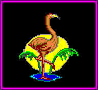

# GANI

The GANI file seems to contain a single image of a flamingo. It is 1130 bytes,
and after decompression, inflates to 4236 bytes. The first two bytes seem to
describe the end offset of the image.

| Offset        | Value    | Purpose                              |
|---------------|----------|--------------------------------------|
| 0x00          | 0x01     | Unknown (number of images?)          |
| 0x01-0x02     | 0x8910   | Size of image (0x1089)               |
| 0x03          | 0x05     | Unknown                              |
| 0x04          | 0x00     | Unknown                              |
| 0x05          | 0x30     | Number of words per line (48)        |
| 0x06          | 0x58     | Height of image (88 pixels)          |
| 0x07          | 0x00     | ?                                    |
| 0x08          | 0x00     | ?                                    |
| 0x09 - 0x1088 | variable | Image data of flamingo               |
| 0x1089        | 0x01     | Number of times to copy image?       |
| 0x108A        | 0x00     | ?                                    |
| 0x108B        | 0xFF     | ?                                    |

This image (which is 96x88 pixels) in the file is shown below:

